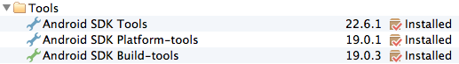
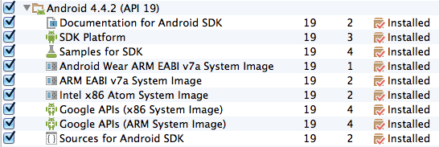
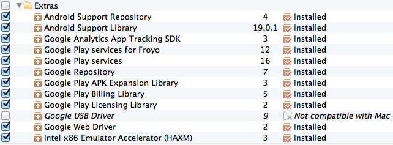

#Android Workshop for Beginners

Thanks for your interest in this Android Workshop for Beginners! This page is heads-up what the workshop is all about and to lay out the prerequisites 
to setup your Android development environment.

## What you _will_ learn in this workshop

**[Lesson 1](lesson01) Android Studio and Android projects**
* Importing Android Gradle projects in Android Studio
* Navigating through a typical Android Studio (Gradle) Project structure
* Building and running Android apps on your own device or Android Virtual Device (AVD).
* Basic understanding of resources and resource qualifiers

**[Lesson 2](lesson02) Activities and Views**
* Working with **Activities**, and get basic understanding of the Activity Life Cycle
* Learn about common **Views** or _widgets_ and how to add them to an **Activity**
* Learn how to interact with these views in your code.
* Learn how to _listen_ to a click event.

**[Lesson 3](lesson03) Intents, Tasks and the Activity Back Stack**
* Basic understanding of tasks and the _activity back stack_
* Move from one **Activity** to another with _explicit_ and _implicit_ **Intents**

**[Lesson 4](lesson04) ListViews and Adapters**
* Basic understanding of **ListViews** and **Adapters**
* Working with the **ArrayAdapter**
* Creating String Array resources
* Extending the **BaseAdapter** to create a custom adapter
* Creating more complex layouts for the list items

**[Lesson 5](lesson05) Creating a simple image viewer app**
* Basic understanding of **Fragments**
* Basic understanding of **ViewPagers** and the **FragmentPagerAdapter**
* Playing (animal ;-) sounds with the **MediaPlayer**

## What you _won't_ learn in this workshop

* The Java language and syntax
* Basic Object Oriented (OO) programming
* Basic event driven programming
* Working with Services, Broadcast Receivers, Databases, etc.

## Setting up your workshop development environment
This workshop is aimed at the intermediate Java or OO programmer who wants to start with native Android development. As a prerequisite we ask you to setup a working Android development environment. Please check if you have already installed (if not download and install) the following software on your computer:

* A [Git](http://git-scm.com/downloads) client or command line tool to clone this repository. [Sourcetree](http://www.sourcetreeapp.com/) is a pretty cool Git GUI client.
* A [Java Software Development Kit (JDK)](http://www.oracle.com/technetwork/java/javase/downloads/index.html) version 6 on a Mac or version 6 or 7 if you are using a Windows or Linux machine. I advice against using JDK 8 for this workshop. A Java Runtime Environment (JRE) is not enough!
* The [Android Studio](http://developer.android.com/sdk/installing/studio.html) bundle, which includes: 
  * The Android Studio early access preview IDE, which is based on the community edition of IntelliJ IDEA. 
  * All the Android SDK Tools to design, test, debug, and profile your app. 
  * The latest Android platform to compile your app. 
  * The latest Android system image to run your app in the emulator

* After you have installed **Android Studio** you might need to update to the latest version (v0.5.2 was the latest end of March 2014)
* Fire up Android Studio and check that you have the latest **Tools**, **Android platform** and *Extras** installed. You can access the SDK manager by clicking on the SDK Manager Icon  in the toolbar. Your configuration should look something like this

> You only need the latest versions of the **Tools**, **Platform-tools** and **Build-tools**

> Simply click the checkbox before the **Android 4.4.2 (API 19)** folder to select everything

> Again, if you have the hard disk space, simply install everything in the **Extras** section for the workshop. FYI The **Google USB Driver** is only compatible with Windows machines. So install that if you run Android Studio on windows and want to connect your dev phone via a USB cable.

* If you have selected all the packages above click the “Install Packages” button and sit tight.
* Preferably we would like you to connect your phone to your computer and run and test the samples on a real device. If you don't own an Android device you can install an Android emulator, also known as an Android Virtual Device (AVD). Install at least one Android Virtual Device (AVD) running Jelly Bean, but preferably KitKat, for this workshop. All the capabilities of the AVD Manager are accessible directly from the Android Studio interface. Click the AVD Manager Icon  in the toolbar to open it and create new AVDs. **Note: If you connect your Android device to a Windows machine make sure you have installed the correct device driver for your Android device. If you have ever successfully connected your Android device to your PC you probably already have it.**

If you've installed all the necessary development kits described above you are all set for the workshop!

[Go to lesson 1](lesson01)
