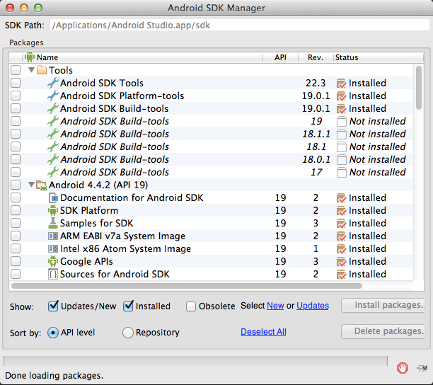

#Android Workshop for Beginners

## Introduction
This workshop is aimed at the intermediate Java or OO programmer who wants to start with native Android development. As a prerequisite we ask you to setup a working Android development environment. Please check if you have already installed (if not download and install) the following software on your computer:

* A [Java Software Development Kit (JDK)](http://www.oracle.com/technetwork/java/javase/downloads/index.html) version 6 or higher. A Java Runtime Environment (JRE) is not enough!
* The [Android Studio](http://developer.android.com/sdk/installing/studio.html) bundle, which includes: 
  * The Android Studio early access preview IDE, which is based on the community edition of IntelliJ IDEA. 
  * All the Android SDK Tools to design, test, debug, and profile your app. 
  * The latest Android platform to compile your app. 
  * The latest Android system image to run your app in the emulator
* Fire up Android Studio and check that you have the latest Android SDK platform, SDK Tools, SDK Platform tools installed. You can access the SDK manager by clicking on the SDK Manager Icon  in the toolbar. Your configuration should look something like this

* Preferably we would like you to connect your phone to your computer and run and test the samples on a real device. If you don't own an Android device you can install an Android emulator, also known as an Android Virtual Device (AVD). Install at least one Android Virtual Device (AVD) running Jelly Bean, but preferably KitKat, for this workshop. All the capabilities of the AVD Manager are accessible directly from the Android Studio interface. Click the AVD Manager Icon  in the toolbar to open it and create new AVDs. **Note: If you connect your Android device to a Windows machine make sure you have installed the correct device driver for your Android device. If you have ever succesfully connected your Android device to your PC you probably already have it.**

## What you _will_ learn in this workshop

* Importing Android Gradle projects in Android Studio
* Navigating through a typical Android Studio (Gradle) Project structure
* Building and running Android apps on your own device or Android Virtual Device (AVD).
* Working with Activities, and get basic understanding of the Activity Life Cycle
* Working with the LinearLayout and RelativeLayout
* Understand how to add various Views or _widgets_ to an Activity
* Move from one Activity to another with Intents
* Basic understanding of resources and resource qualifiers
* Basic understanding of ListViews and Adapters

## What you _won't_ learn in this workshop

* The Java language and syntax
* Basic Object Oriented (OO) programming
* Basic event driven programming
* Working with Fragments, Services, Broadcast Receivers, databases, etc.

[Go to lesson 1](lesson01)
