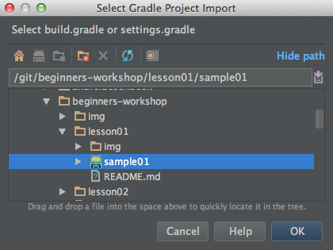

# Lesson 01<br/>Android Studio and Android projects

## What you'll learn in this lesson
* Importing an Android project in Android Studio
* Understand and navigate the basic Android project structure in Android Studio
  * Learn about the AndroidManifest.xml file
  * Know where the java source files are located
  * Understand the basics of resources
* Know the basics about and how to start the Android Tools from Android Studio
  * The Android SDK Manager 
  * The Android Virtual Device (AVD) Manager
  * The Device Debug Monitoring System (DDMS)
  
If you know all about the learning goals for this lesson move on to [lesson 2](../lesson02)

## Android Studio

### Importing an Android project in Android Studio
Android Studio contains a new project wizard which is started by chosing **File > New Project...**. However convenient it also poses a lot of questions, settings and steps which might be a bit too overwhelming at this point. For this workshop we would like to teach you how to import an existing Android project so we can keep the project contents consise to what is needed in the sample or exercise. In this lesson we are going to import a very tiny "Hello World" app.


> The File Menu


>The Quick Start Menu

In Android Studio, chose **File > Import Project...** or select the **Import Project...** option from the quick start menu and select the **sample01** folder. 


>Select Gradle Project import. Android Studio may ask you to choose the type of project you are importing. If this is the case, make sure to choose **Import project from external model** and select the **Gradle** option.

If all's well Android Studio will start to build your project right away.

### The Android Project structure
If you have imported the **sample01** project successfully you will end up with a project structure like this


#### Gradle build files
At the root of the project folder you can see various gradle files. You can use [command line tools](http://developer.android.com/tools/building/building-cmdline.html), [Ant](http://ant.apache.org/), [Maven](http://maven.apache.org/) and [Gradle](http://www.gradle.org/) to build and package your Android projects. The Android Tools team have chosen the highly flexible [Gradle](http://www.gradle.org/) build system as the main Android build system. You can read more about the new build system [here](http://tools.android.com/tech-docs/new-build-system). 

The **build.gradle**, **gradle.properties** and **settings.gradle** files describe how to build the helloworld project.

* The **settings.gradle** file describes which sub-projects to include. This is only the **helloworld** project folder in our case
* The **build.gradle** file in the root folder describes the necessary dependencies for the build itself and a common setup for all projects
* The **helloworld/build.gradle** describes how to build our Android project. It applies an android plugin and describes the configuration.

The **gradlew** and **gradlew.bat** scripts (for unix resp. Windows environments) are gradle _wrapper_ scripts. You can run a build on the command line using this script. It requires a certain Gradle version and if it is not present it downloads the binaries on the fly. The **gradlew** scripts and **gradle** directory are added automatically when you create a project with the Android Studio New Project Wizard and 

```
sample01> ./gradlew assembleDebug
:helloworld:compileDebugNdk UP-TO-DATE
:helloworld:preBuild
:helloworld:preDebugBuild
:helloworld:checkDebugManifest
:helloworld:prepareDebugDependencies
:helloworld:compileDebugAidl UP-TO-DATE
:helloworld:compileDebugRenderscript UP-TO-DATE
:helloworld:generateDebugBuildConfig UP-TO-DATE
:helloworld:mergeDebugAssets UP-TO-DATE
:helloworld:generateDebugResValues UP-TO-DATE
:helloworld:generateDebugResources UP-TO-DATE
:helloworld:mergeDebugResources UP-TO-DATE
:helloworld:processDebugManifest UP-TO-DATE
:helloworld:processDebugResources UP-TO-DATE
:helloworld:generateDebugSources UP-TO-DATE
:helloworld:compileDebugJava UP-TO-DATE
:helloworld:preDexDebug UP-TO-DATE
:helloworld:dexDebug UP-TO-DATE
:helloworld:processDebugJavaRes UP-TO-DATE
:helloworld:validateDebugSigning
:helloworld:packageDebug UP-TO-DATE
:helloworld:assembleDebug UP-TO-DATE

BUILD SUCCESSFUL

Total time: 5.702 secs
```

#### The project build.gradle file
The **build.gradle** file in the helloworld directory is very simple.

```
apply plugin: 'android'

android {
    compileSdkVersion 19
    buildToolsVersion "19.0.2"

    defaultConfig {
        minSdkVersion 14
        targetSdkVersion 19
        versionCode 1
        versionName "1.0"
    }
}

dependencies {
    compile fileTree(dir: 'libs', include: ['*.jar', '*.aar'])
}
```

The **minSdkVersion** version states which Android OS level you minimally support with your app. We have chosen to support version 14 (Android 4.0 - Ice Cream Sandwich) and up in this workshop.

The **targetSdkVersion** informs the system that you have tested against the target version and the system should not enable any compatibility behaviors to maintain your app's forward-compatibility with the target version. The application is still able to run on older versions (down to **minSdkVersion**). To maintain your application along with each Android release, you should increase the value of this attribute to match the latest API level, then thoroughly test your application on the corresponding platform version.

The **versionCode** is a value which is used mainly for distribution on Google Play. Every update should have a higher version code than the previous package.

The **versionName** value is a user-friendly name for the app version and can be any string. This value is visible to the end-users on Google Play.

#### AndroidManifest.xml
Every application must have an AndroidManifest.xml file (with precisely that name) in its root directory. Let's open up the AndroidManifest.xml file of the helloworld app.

```xml
<?xml version="1.0" encoding="utf-8"?>
<manifest xmlns:android="http://schemas.android.com/apk/res/android"
    package="org.dutchaug.workshop.beginners.helloworld" >

    <application
        android:allowBackup="true"
        android:icon="@drawable/ic_launcher"
        android:label="@string/app_name"
        android:theme="@android:style/Theme.Holo.Light">
        <activity
            android:name=".MainActivity"
            android:label="@string/app_name" >
            <intent-filter>
                <action android:name="android.intent.action.MAIN" />
                <category android:name="android.intent.category.LAUNCHER" />
            </intent-filter>
        </activity>
    </application>

</manifest>
```

The manifest file presents essential information about your app to the Android system, information the system must have before it can run any of the app's code. Among other things, the manifest does the following:

* It names the Java **package** for the application. The package name serves as a unique identifier for the application.
* It describes the components of the application (in our example the activity MainActivity) and under what conditions they can be launched.
* It declares which permissions the application must have in order to access protected parts of the API and interact with other applications. We don't require any extra permissions in our app, but if you e.g. need internet access, or want to lookup a contact you need to declare those permission here. [More info](http://developer.android.com/reference/android/Manifest.permission.html)
* It declares the minimum level of the Android API that the application requires. In our case this information is not present in our development AndroidManifest.xml file, but it will be added in the Gradle build, using the information in the **defaultConfig** section in the ./hellworld/build.gradle file.

[More info](http://developer.android.com/guide/topics/manifest/manifest-intro.html)

#### Java source files
Okay, let's walk around on familiar ground... Java. We only have one class in our Hello World project, the MainActivity class. Let's open up MainActivity.java and see what's inside.

> You can quickly open a class-file by pressing &#8984;-O on a Mac and ctrl-N on a Windows machine.

```java
package org.dutchaug.workshop.beginners.helloworld;

import android.app.Activity;
import android.os.Bundle;

public class MainActivity extends Activity {

    @Override
    protected void onCreate(Bundle savedInstanceState) {
        super.onCreate(savedInstanceState);
        setContentView(R.layout.activity_main);
    }

}
```

The **onCreate** method is one of the Activity Life Cycle methods (more on that in [lesson02](../lesson02)) and in plain English, when our activity is created (by the Android system) don't do anything with the saved instance state (we propagate it to our super class) and set the content view layout to **R.layout.activity_main**.

**R.layout.activity_main** refers to an integer in a generated class with name R. Go ahead, open R.java and see what's inside. See anything familiar? Browse around the **res** folder if this doesn't ring any bells. In short Android keeps references of all the resources in the **res** directory and saves references to these files as public static final integers in the R.java file. Again, this file is generated, so don't change anything in this file directly, change the file (or their contents) in the **ress** directory instead.

#### Resources

> The Android project resources

A resource is a localized text string, bitmap, video, soundbit or other small piece of noncode information that your program needs. At build time all your resources get compiled into your application. This is useful for internationalization and for supporting multiple device types.

You will create and store your resources in the res directory inside your project. The Android resource compiler (aapt) processes resources according to which subfolder they are in and the format of the file. For example, PNG and JPG format bitmaps should go in a directory starting with res/drawable, and XML files that describe screen layouts should go in a directory starting with res/layout. You can add suffixes for particular languages, screen orientations, pixel densities, and more.

The resource compiler compresses and packs your resources and then generates a class named R that contains identifiers you use to reference those resources in your program. This is a little different from standard Java resources, which are referenced by key strings. Doing it this way allows Android to make sure all your references are valid and saves space by not having to store all those resource keys. Eclipse uses a similar method to store and reference the resources in Eclipse plug-ins.

##### Resource quantifiers
You might have noticed there are several **drawable** directories with different suffixes. These suffixes are called qualifiers and narrow down for which devices these resources should be used. In the drawable case, all the default drawables go into the **drawable** directory directory. Any optimized images for e.g. a high density (hdpi), medium density (mdpi) or extra high density (xhdpi) screen go into the **drawable-hdpi**, **drawable-mdpi** and **drawable-xhdpi** directories respectively. Drawables in these directories _override_ any drawables in less specific / qualified directories. [More info](http://developer.android.com/guide/practices/screens_support.html)

##### Localization resources
In the **res/values** directory we see a **strings.xml** file. This file contains one _string-resource_ with name `app_name`.

Suppose that your application's default language is English. Suppose also that you want to localize all the text in your application to Dutch. In this case, you could create an alternative strings.xml files, stored in a locale-specific resource directory:

* **res/values/strings.xml** Contains English text for all the strings that the application uses, including text for a string named `app_name`.
* **res/values-nl/strings.xml** Contain Dutch text for all the strings.

[More info](http://developer.android.com/guide/topics/resources/localization.html)

> Localization is not only for strings. You can localize any resource type by adding the **-&lt;locale&gt;** suffix, e.g. **res/drawable-nl** could contain images with e.g. dutch language.

#### Layouts
We already saw a reference to **R.layout.activity_main** in the **onCreate** method in MainActivity.java. This integer points to the file **res/activity_main.xml**. Let's open that file.

```xml
<LinearLayout xmlns:android="http://schemas.android.com/apk/res/android"
    android:layout_width="match_parent"
    android:layout_height="match_parent">

    <TextView
            android:layout_width="match_parent"
            android:layout_height="match_parent"
            android:text="@string/app_name"
            android:gravity="center"/>

</LinearLayout>
```

>The most used method to describe User Interfaces in Android is XML. There's nothing holding you back in creating UIs in code directly, but there are two main reasons why XML is prefferred in most cases.
>
>1. **Separation Of Concerns (SOC)** - Defining your UI in xml helps you separate the UI from the code that controls its behavior.
>2. **Resource qualifiers** - Storing different layout XML files in different (qualified) resource directories is a powerful tool to create different user experiences for different device types. The most simply case is a default UI in the **res/layout** directory and e.g. a _landscape_ version of your UI in the **res/layout-land** directory!
>
>[More info](http://developer.android.com/guide/topics/ui/declaring-layout.html)

**LinearLayout** is a **ViewGroup**. It can describes the way it layouts its children (in a linear way). **RelativeLayout** lays out its children _relative_ to other views in the view group, or to the parent border (the RelativeLayout itself). **GridLayout** lays out its children in a grid. There are a couple of other layout managers and it's pretty easy to create a layout manager yourself.

Some parameters are common to all layouts:
* **xmlns:android="http://schemas.android.com/apk/res/android"** Defines the XML namespace for Android. You should define this once, on the first XML tag in the file.
* **android:layout_width="match_parent"**, **android:layout_height="fill_parent"** Takes up the entire width and height of the parent (in this case, the window). Possible values are match_parent and wrap_content.

##Exercises
> For the following exercises you can open the **Android preview** tool window to see the effect. There's no need to compile and deploy the app on your phone yet.

1. Change the **android:layout_width** and **android:layout_height** attributes of both the **LinearLayout** and the **TextView** to `wrap_content`. Can you explain what happens?
1. Add another **TextView** to the **res/activity_main.xml** layout file and see what happens. Can you predict how the other TextView will be layed out?
1. Add an attribute **android:orientation="vertical"** to the **LinearLayout** tag. What happens?
1. Add an attribute **android:textColor="#B20"** to the **TextView** tag.
1. Create a new resource file with name **res/drawable/background.xml** and add the xml below to that file. Now add an attribute **android:background="@drawable/background"** to the **LinearLayout** tag.

```xml
<shape xmlns:android="http://schemas.android.com/apk/res/android" android:shape="rectangle" >
  <gradient 
    android:type="linear"
    android:centerX="15%" 
    android:startColor="#FFFF8340" 
    android:centerColor="#FFFF8340" 
    android:endColor="#FF052280" 
    android:angle="45"/>
</shape>
```

> A very powerful tool in Android... Create shape drawables in XML! [This on-line tool](http://angrytools.com/gradient/) can create these gradient XML files for you. Simply click the **Android** tab below to get the generated XML.

## Android Tools

### SDK Manager

### AVD Manager

### DDMS

##Conclusion
TODO

On to [lesson 2](../lesson02)