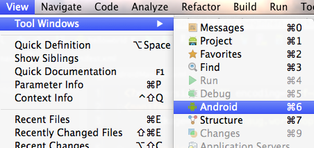
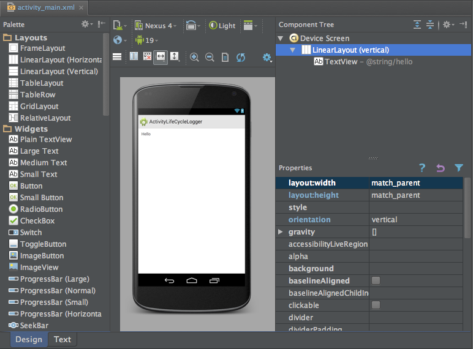

# Lesson 02<br/>Activities and Views

## What you'll learn in this lesson
* Working with Activities, and get basic understanding of the Activity Life Cycle
* Learn about common Views or _widgets_ and how to add them to an Activity
* Learn how to interact with these views in your code.
* Learn how to _listen_ to a click event.

If you know all about the learning goals for this lesson move on to [lesson 3](../lesson03)

## Activities
An activity usually is a full Android screen that a user sees or interacts with. The `onCreate` method you saw in the MainActivity in lesson 1 is what we call a _life cycle callback_ method and this gives you a hook where you can initialize your activity when the Android system decides it is time to show your activity to the user. The [Activity life cycle](http://developer.android.com/reference/android/app/Activity.html#ActivityLifecycle) is very important and deserves good understanding when you are planning to do more Android development after this workshop.

## The MainActivity launch intent filter
When the user selects your app icon from the Home screen, the system calls the `onCreate()` method for the Activity in your app that you've declared to be the "launcher" (or "main") activity. This is the activity that serves as the main entry point to your app's user interface.

You can define which activity to use as the main activity in the Android manifest file, AndroidManifest.xml, which is at the root of your project directory.

The main activity for your app must be declared in the AndroidManifest.xml file with an `<intent-filter>` that includes the MAIN action and LAUNCHER category. For example:

```xml
<activity
        android:label="@string/app_name"
        android:name=".MainActivity">
    <intent-filter>
        <action android:name="android.intent.action.MAIN"/>
        <category android:name="android.intent.category.LAUNCHER"/>
    </intent-filter>
</activity>
```

If either the MAIN action or LAUNCHER category are not declared for one of your activities, then your app icon will not appear in the Home screen's list of apps.

## The Activity Life Cycle
During the life of an activity, the system calls a core set of lifecycle methods in a sequence similar to a step pyramid. That is, each stage of the activity lifecycle is a separate step on the pyramid. As the system creates a new activity instance, each callback method moves the activity state one step toward the top. The top of the pyramid is the point at which the activity is running in the foreground and the user can interact with it.

As the user begins to leave the activity, the system calls other methods that move the activity state back down the pyramid in order to dismantle the activity. In some cases, the activity will move only part way down the pyramid and wait (such as when the user switches to another app), from which point the activity can move back to the top (if the user returns to the activity) and resume where the user left off.


> **Figure 1**.  A simplified illustration of the Activity lifecycle, expressed as a step pyramid. This shows how, for every callback used to take the activity a step toward the Resumed state at the top, there's a callback method that takes the activity a step down. The activity can also return to the resumed state from the Paused and Stopped state.

### Using logcat

The Android logging system provides a mechanism for collecting and viewing system debug output. Logs from various applications and portions of the system are collected in a series of circular buffers, which then can be viewed and filtered by the `adb logcat` command, or directly from Android Studio by pressing the  button on the control bar at the bottom or selecting **View | Tool Windows | Android** from the menu. [More info](http://developer.android.com/tools/debugging/debugging-log.html)



A good way to keep an eye on _which_ life cycle method is called _when_ is to simple create a log statement in the life cycle method overrides. For example in the `onCreate` method.

```java
public void onCreate(Bundle savedInstanceState) {
	Log.d(TAG, "onCreate");
	super.onCreate(savedInstanceState);
}
```

Where `TAG` is a (class) constant with a String you can filter on in your logcat session. Some people use a single TAG for the whole application, but most use the following construct to create a unique tag for every class.

```java
private static final String TAG = MainActivity.class.getSimpleName();
```

Or, if you are just interested in which methods are called when, you can just use Jake Wharton's [Hugo](https://github.com/JakeWharton/hugo) library.

Add this to your build.gradle file

```
buildscript {
  dependencies {
    classpath 'com.jakewharton.hugo:hugo-plugin:1.0.1'
  }
}

apply plugin: 'android'
apply plugin: 'hugo'
```

And than add the `@DebugLog` annotation to any method you want to _debug log_.

A couple of the Activity life cycle methods in the [MainActivity](sample02/lifecyclelogger/src/main/java/org/dutchaug/workshop/beginners/lifecyclelogger/MainActivity.java) in [sample02](sample02) are annotated with the `@DebugLog` annotation. Take that project for a spin to get a grasp of how your activity is managed by the system.

## Exercises

### Adding new views to the layout
Open the [activity_main.xml](sample02/lifecyclelogger/src/main/res/layout/activity_main.xml) file in the [sample02](sample02) project in Android Studio and click on the **Design** tab next to the **Text** tab below. You should see something like this.


> Android Design Tool View

On the left you see a long list of **Views** or _widgets_. Grab a **Person Name** from the **Text Fields** section and place it under the **TextView** view. Grab a **Button** from the **Widgets** section and place it under the **EditText** view.

### Referencing views in the layout in your code
To get a reference to the views in the layout in your code you can create a resource-id for every view you want to interact with. Creating an id is done by adding an **android:id** attribute to the views and giving them an (e.g.) **@+id/uniquenameforyourview** value. The "@"-sign identifies a resource (we already saw references to string resources via **@string/app_name** for instance). The "+"-sign just before the **id** indicates we want to _create_ and id. If we forget the "+"-sign the **@id/uniquenameforyourview** becomes a _reference_.

Go ahead and add **android:id** attributes to the **TextView**, **EditText** and **Button** views in the [activity_main.xml](sample02/lifecyclelogger/src/main/res/layout/activity_main.xml) file.

Now open the [MainActivity](sample02/lifecyclelogger/src/main/java/org/dutchaug/workshop/beginners/lifecyclelogger/MainActivity.java) file in Android Studio. When our acitivity is created (in **onCreate**) and our contentView is set the layout in the XML file gets _inflated_ by the Android System. This basically means whatever is in the XML file will be used to create a _View hierarchy_ of plain Java objects we can interact with in our code. We can only create references to our views in the layout, if they have a proper **id**. We can reference them by calling the **findViewById(int id)** method like this.

```java
TextView textView = (TextView) findViewById(R.id.uniquenameforyourview);
```

Go ahead and hook-up all the views in the **onCreate** method in [MainActivity](sample02/lifecyclelogger/src/main/java/org/dutchaug/workshop/beginners/lifecyclelogger/MainActivity.java). Make _fields_ out of the view references while you are at it, so you can reference them from other methods in your class (not just the onCreate method).

### Interacting with the views
You can click on any view in Android, but **Buttons** are, of course, made for that. You can listen to a button click by implementing- and adding a **View.OnCLickListener** to your button.

```java
button.setOnClickListener(this);
```

What we are saying here is that our **MainActivity** should implement the **View.OnCLickListener** interface. If you have added the above line in your **onCreate* method you'll see a red curly line under the **this** reference. Move your cursor on the **this** keyword and press **alt-enter**. Select the second option. You are then prompted to implement the **onClick** method, which is just what we need


Now in the **onClick(View v)** method try to read the value from the **EditText** reference and use that value to update the **TextView** reference.

### Change the app icon
By default you get this standard app launch icon for new Android projects


> Default launch icon

Use the [Android Asset Studio](http://android-ui-utils.googlecode.com/hg/asset-studio/dist/icons-launcher.html#foreground.type=clipart&foreground.space.trim=1&foreground.space.pad=0&foreground.clipart=res%2Fclipart%2Ficons%2Fsocial_send_now.svg&foreColor=c00%2C0&crop=0&backgroundShape=bevel&backColor=ffffff%2C100) to create a new launch icon.

### Change the Activity title
The title of the MainActivity in [sample02](sample02) is set via the **android:label="@string/app_name"** attribute in the [AndroidManifest.xml](sample02/lifecyclelogger/src/main/AndroidManifest.xml) file. Use another string and try to change the title of the MainActivity class in the **onCreate** method.

### Change the background color
Try to change the background color of the MainActivity in the [activity_main.xml](sample02/lifecyclelogger/src/main/res/layout/activity_main.xml) file.

##Conclusion
TODO

On to [lesson 3](../lesson03)