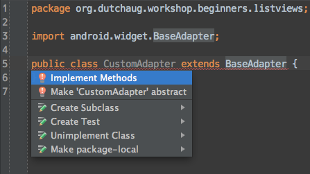
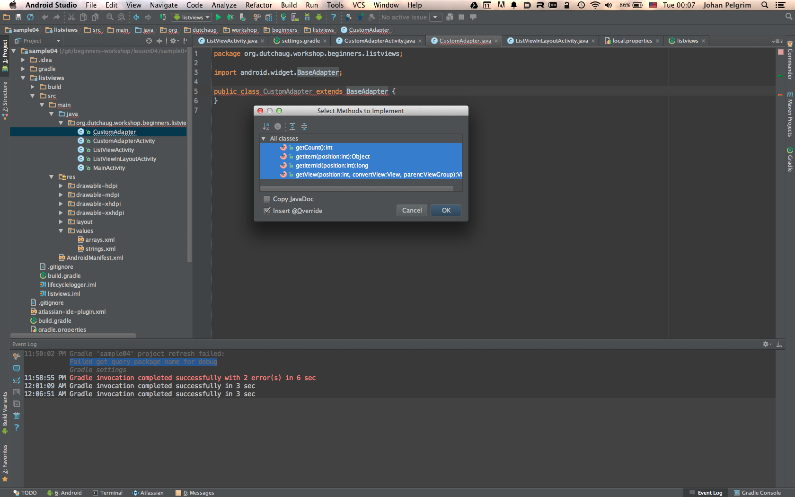

# Lesson 4<br/>ListViews and Adapters

## What you'll learn in this lesson
* Basic understanding of ListViews and Adapters

## Introduction
One of the most frequently used views in Android apps is the [ListView](http://developer.android.com/guide/topics/ui/layout/listview.html). It's also one of the more complex views and one of the most cumbersome things to work with if you don't play by the rules. We hope to give you a solid introduction to good use of this powerful view.

## Adding a ListView to your layout.
A ListView usually displays a (large) list of things which you can vertically scroll. The _things_ in the list can have a custom view layout themselves. For the first example we'll simply use one of the standard layouts which you can find in the android runtime library itself. It's the layout with id `android.R.layout.simple_list_item_1`. It's a very simple layout with just one `TextView` with id `@android:id/text1`

> Press `Cmd-Shift-O` on a Mac or `Ctrl-Shift-N` on a Windows/Linux machine to open the **go to file** prompt. Simply type `simple_list_item_1` in the search field. Click on one of the items you see to view this systems layout file's contents.

Okay, we've got a layout, now we need a _list of things_. You might retrieve your list from a server, or a database in real world Android applications, but it is good to know that for fixed lists you can easily create **string array resources** for every language or device specifically, just as any other Android resource.

```xml
<string-array name="animals">
    <item>bear</item>
    <item>cat</item>
    <item>chicken</item>
</string-array>
```

You can reference a string array resource from a [context](../cheatsheet.md#context) using `getResources().getStringArray(R.array.animals)`

## Adapters
An **Adapter** object acts as a _bridge_ or between an **AdapterView** (in our case the **ListView** which extends from **AdapterView**) and the underlying data for that view (our String array). The Adapter provides access to the data items. The Adapter is also responsible for making a **View** for each item in the data set by implementing a `public View getView (int position, View convertView, ViewGroup parent)` method, which our **ListView** conveniently calls whenever it needs to render the next view for item with position **position** in the list.

The [ArrayAdapter](http://developer.android.com/reference/android/widget/ArrayAdapter.html) is a very simple implementation of the **Adapter** interface, which allows us to bind data in an array to a layout XML file and a single **TextView** in that layout.

We've got all the necessary information to construct an **ArrayAddapter** in our example we use this constructor:

```java
public ArrayAdapter (Context context, int resource, T[] objects)
```

Parameters:

* **context** The current [context](../cheatsheet.md#context).
* **resource** The resource ID for a layout file containing a TextView to use when instantiating views.
* **objects** The objects to represent in the ListView.

## Exercise 04.01
It's time to put the learned stuff into practice!

1. Import [sample04](sample04) in Android Studio 
1. Click on the TODO Tool View double click on the `TODO Exercise 04.01` item. This opens the `ListViewInLayoutActivity.java` file at the spot where you should enter the code below.
1. Set the content view to the `activity_listview_in_layout.xml` layout file.
1. Bind a local `ListView` object to the `ListView` in the layout with a `findViewById` and the id you can find in the `activity_listview_in_layout.xml` layout file.
1. Create a local variable `String[] entries` which contains the items in the `animals` string resource array (see [arrays.xml](sample04/listviews/src/main/res/values/arrays.xml))
1. Create a new **ArrayAdapter** instance with layout id `android.R.layout.simple_list_item_1` and assign this adapter to the **ListView** object. (At this time you should be able to see something on screen, so take your project for a spin here and click on the "ListView in layout" item)
1. **Extra** Create a custom list item layout, with at least one `TextView` with id `@android:id/text1`, and assign that to the `ArrayAdapter` constructor.

##Exercise 04.02
1. Import [sample04](sample04) in Android Studio (if you have not done that already in exercise 04.01)
1. Click on the TODO Tool View double click on the `TODO Exercise 04.02` item.
1. Again create a local variable `String[] entries` which contains the items in the `animals` string resource array (see [arrays.xml](sample04/listviews/src/main/res/values/arrays.xml))
1. Create a new array adapter with layout id `android.R.layout.simple_list_item_1` and assign this adapter to the list view via the `getListView()` method. (You should be able to see something on screen, so take your project for a spin here and click on the "ListActivity" item)
1. **Extra** Override the `protected void onListItemClick(ListView l, View v, int position, long id)` method and try to display the animal name via a [Toast](../cheatsheet.md#toast)

## Building a custom adapter with BaseAdapter
Okay, a list with Strings is kind of nice as an example, but what about a list with a little bit more information. Let's say a list of animals with a thumbnail image and two textviews with the animal name and the type of animal. Something like this:


How do we go about creating that?

> You can read through the next steps or even better, follow along and do all the steps yourself! 

Okay, we create a new class with name `CustomAdapter` which extends the `BaseAdapter` class.  Android Studio will immediately show you something is wrong by red underlining the class definition. Hover your mouse over the red curly line to see what's wrong.


Move your cursor to the line in error an press `Alt-Enter` to see some quickfixes



Select `Implement methods`, select all the suggested methods, click **OK** and watch the magic unfold.



* The `getCount` method should return the number of items in our adapter. 
* The `getItem` method should return the actual data object for a certain position. 
* The `getItemId` should return a unique id for our data item at the given position. 
* The `getView` method is the most important and most complex method to override. The `getView` method is responsible for binding a data item at the given position to a new or recycled view (the `convertView` argument).

If the `convertView` argument is `null` you have to use a so called [LayoutInflater](http://developer.android.com/reference/android/view/LayoutInflater.html) to convert the layout XML file to an actual `View` object. Here's how you do this in the `getView` method:

```java
if (convertView == null) {
  LayoutInflater layoutInflater = (LayoutInflater) mContext.getSystemService(Context.LAYOUT_INFLATER_SERVICE);
  convertView = layoutInflater.inflate(R.layout.custom_layout, null, false);
}
```

The `mContext` field is something you normally initialize in your custom adapter constructor. (Sometimes people initialize the LayoutInflater as a field in the constructor as well.)

```java
public CustomAdapter(Context context) {
  this.mContext = context;
}
```

You can use the `convertView` to find the image thumbnail and two text views.

```java
ImageView imageView = (ImageView) convertView.findViewById(R.id.thumbnail_image);
// Set the image resource of imageView to something you retrieve from your data

TextView textView = (TextView) convertView.findViewById(R.id.animal_name);
// Etc.
```

At the end of the `getView` method you should return the updated `convertView` which will be used as an item in the list view.

Okay, let's see this in action.

##Exercise 04.03
1. Import [sample04](sample04) in Android Studio (if you have not done that already in the previous exercises 04.01)
1. Click on the TODO Tool View double click on the `TODO Exercise 04.03` item.
1. Complete the `getCount()`, `getItem(int position)` and `getItemId(int position)` methods to return valid values and take your project for a spin. 
1. In `CustomAdapterActivity` complete the `onListItemClick` method. Use the `position` to retrieve an `Animal` object from the `mCustomerAdapter` field and use the `animal.infoUrl` information to create a valid `Uri`.
1. **Extra exercise** Instead of using a `ListView` use a [GridView](http://developer.android.com/guide/topics/ui/layout/gridview.html) and the same custom adapter to create a grid of animals.

## Conclusion
The `ListView` and the `BaseAdapter` are powerful tools to create great looking lists in your app. This lesson only showed you the tip of the iceberg. There are still many things to discover for a correct and optimal implementation of great performing lists. For example it is highly adviced to use the [ViewHolder pattern](http://developer.android.com/training/improving-layouts/smooth-scrolling.html#ViewHolder) for better performance. At some point in time you might want to add [sections to your list view](http://cyrilmottier.com/2011/07/05/listview-tips-tricks-2-section-your-listview/) or even show [multiple views types in your list](http://antew.com/?p=162).

On to [lesson 5](../lesson05)