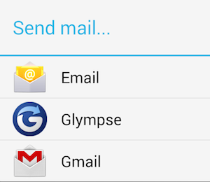
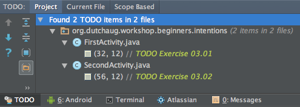

# Lesson 3<br/>Intents, Tasks and the Activity Back Stack

## What you'll learn in this lesson
* Basic understanding of tasks and the _activity back stack_
* Move from one **Activity** to another with _explicit_ and _implicit_ **Intents**

If you know all about the learning goals for this lesson move on to [lesson 4](../section4/README.md)

## Introduction
An application usually contains multiple activities. Each activity should be designed around a specific kind of action the user can perform and can start other activities. For example, an email application might have one activity to show a list of new email. When the user selects an email, a new activity opens to view that email.

An activity can even start activities that exist in other applications on the device. For example, if your application wants to send an email, you can define an intent to perform a "sendto" action and include some data, such as an email address and a message. An activity from another application that declares itself to handle this kind of intent then opens. In this case, the intent is to send an email, so an email application's "compose" activity starts.


> **Figure 1**. If multiple activities support the same intent, then the system lets the user select which one to use. 

When the email is sent, your activity resumes and it seems as if the email activity was part of your application. Even though the activities may be from different applications, Android maintains this seamless user experience by keeping both activities in the same task.

>**Task** A _task_ is a collection of activities that users interact with when performing a certain job. The activities are arranged in a stack (the "back stack"), in the order in which each activity is opened.

The device Home screen is the starting place for most tasks. When the user touches an icon in the application launcher (or a shortcut on the Home screen), that application's task comes to the foreground. If no task exists for the application (the application has not been used recently), then a new task is created and the "main" activity for that application opens as the root activity in the stack.

When the current activity starts another, the new activity is pushed on the top of the stack and takes focus. The previous activity remains in the stack, but is stopped. When an activity stops, the system retains the current state of its user interface. When the user presses the Back button, the current activity is popped from the top of the stack (the activity is destroyed) and the previous activity resumes (the previous state of its UI is restored). Activities in the stack are never rearranged, only pushed and popped from the stack—pushed onto the stack when started by the current activity and popped off when the user leaves it using the Back button. As such, the back stack operates as a "last in, first out" object structure. Figure 2 visualizes this behavior with a timeline showing the progress between activities along with the current back stack at each point in time.


> **Figure 2**. A representation of how each new activity in a task adds an item to the back stack. When the user presses the Back button, the current activity is destroyed and the previous activity resumes.

If the user continues to press Back, then each activity in the stack is popped off to reveal the previous one, until the user returns to the Home screen (or to whichever activity was running when the task began). When all activities are removed from the stack, the task no longer exists.

[More info](http://developer.android.com/guide/components/tasks-and-back-stack.html)

##Intents
An Intent is a messaging object you can use to request an action from another app component. 

An Activity represents a single screen in an app. You can start a new instance of an Activity by passing an **Intent** to **startActivity()**. The Intent _describes_ the activity to start and carries any necessary data. 

### Explicit intents
When working within your own application, you'll often need to simply launch a known activity. You can do so by creating an intent that explicitly defines the activity you want to start, using the class name. For example, here's how one activity starts another activity named SignInActivity:

```java
Intent intent = new Intent(this, SignInActivity.class);
startActivity(intent);
```

### Implicit intents
However, your application might also want to perform some action, such as send an email, text message, or status update, using data from your activity. In this case, your application might not have its own activities to perform such actions, so you can instead leverage the activities provided by other applications on the device, which can perform the actions for you. This is where intents are really valuable—you can create an intent that describes an action you want to perform and the system launches the appropriate activity from another application. If there are multiple activities that can handle the intent, then the user can select which one to use. 

For example, if you want to allow the user to send an email message, you can create the following intent:

```java
Intent intent = new Intent(Intent.ACTION_SENDTO, Uri.parse("mailto:info@dutchaug.org"));
intent.putExtra(Intent.EXTRA_SUBJECT, "Hi there!");
intent.putExtra(Intent.EXTRA_TEXT, "This is the e-mail body");
startActivity(Intent.createChooser(intent, "Send mail..."));
```

 When an email application responds to this intent, it reads the strings provided in the extras and places them in the appropriate fields of the email composition form. In this situation, the email application's activity starts and when the user is done, your activity resumes.

[More Info](http://developer.android.com/guide/components/activities.html)

##Exercise


1. Import the [sample03](sample03) project in Android Studio
1. Click on the TODO Tool View double click on the `TODO Exercise 03.01` item.
1. Implement the following code: 
  * Retrieve the e-mail address and subject from their EditText views.
  * Create an _explicit_ intent and use intent extras to pass the retrieved e-mail address and -subject to that intent. Start the **SecondActivity** and provide it with the intent just created.
1. Click on the TODO Tool View double click on the `TODO Exercise 03.02` item.
1. Implement the following code: 
  * Retrieve the e-mail message from the **EditText** view.
  * Create an _implicit_ intent to send an e-mail and pass the retrieved e-mail address, subject and message in an intent extra.
1. On the command line type `adb shell dumpsys activity` and try to interpret the output.
  
> Notice that you don't need any special permissions to use implicit intents to chain another activity to task. You are basically leaving the end user in control of how and what will be done with their data. They can simply cancel the e-mail composition by pressing the back button. If you want to send e-mail directly from your app, without user intervention you must at least request the [INTERNET](http://developer.android.com/reference/android/Manifest.permission.html#INTERNET) persmission and do all the SMTP preparing and sending yourself. [Here](http://mobiledevtuts.com/android/android-sdk-smtp-email-tutorial/)'s a tutorial which uses [JavaMail for Android](https://code.google.com/p/javamail-android/) to achieve this task.

## Additional Exercise
In this additional exercise we are going to change the flow of the application. FirstActivity will show the email address, subject, message and a button to send the email. SecondActivity will show a big EditText view and a 'ready' button which will send the entered message back to the FirstActivity.

* Add an EditText view to activity_first.xml which will show just three lines of the email message.

```xml
  <EditText
        android:id="@+id/email_message"
        android:layout_width="match_parent"
        android:layout_height="wrap_content"
        android:lines="3"
        android:focusable="false"
        android:layout_marginBottom="12dp"
        android:hint="@string/email_message" />
```  

* When the EditText view with the email message is clicked we want to open the SecondActivity. To accomplish this add an OnClickListener to the message view and open the SecondActivity screen with the code below.

```java
Intent intent = new Intent(FirstActivity.this, SecondActivity.class);
startActivityForResult(intent, 12345);
```

* Move the functionality for sending the email from the onClick method of the SecondActivity to the onClick method of the FirstActivity. You will have to make some little adjustments to the code.

* Change the onClick method of the SecondActivity so it will return the provided email message back to the FirstActivity. Use the code below.

```java
Intent intent = new Intent();
intent.putExtra("message", mEmailMessage.getText().toString());
setResult(12345, intent);
finish();
```

* Add the onActivityResult method to the FirstActivity to handle the email message provided by the SecondActivity. Use code given below.

```java
protected void onActivityResult(int requestCode, int resultCode, Intent data) {
   if (requestCode == 12345) {
      if (resultCode == RESULT_OK) {
         // assign data.getStringExtra("message") to the mEmailMessage EditText view.
      }
   }
}
```

* Since we are no sending the email address and subject to the SecondActivity anymore, remove in the onCreate method of the SecondActivity the code which expects the email address and subject to be provided.


##Conclusion
Using _implicit_ and _explicit_ **Intents** wisely will transform your app into an efficient way to perform a certain **Task**. Don't reinvent the wheel if somebody else, or a system activity can do this step in the task for you! On to [lesson 4](../section4/README.md) where you will learn about a very frequenlty used **View** the **ListView**.
